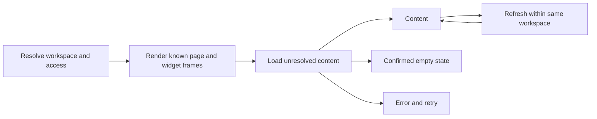

# Loading and empty states in Advantage Analytics

## Recommendation

Advantage should keep the authenticated workspace shell and the frames of predictable widgets visible, and load data inside those frames. Use a coherent skeleton treatment for initial data loading, preserve existing content during refreshes within the same workspace, and show a stationary empty state when a successful response confirms there is no content. A spinner remains appropriate for a discrete action or a brief prerequisite that genuinely prevents the application from choosing a screen.

Loading and emptiness are different facts. It is normal for an initially unknown widget to move from loading to empty. It is unnecessary for an account already known to be empty to repeat that sequence. It is also undesirable to make one navigation pass through a generic spinner, a page-wide placeholder, and a differently shaped widget placeholder before the useful screen appears.

This is a product-specific recommendation, not a claim that skeletons universally outperform spinners. The priority is continuity: athletes and coaches should understand which workspace they are viewing, what each region contains, and whether they need to wait or act.

## Evidence and its limits

IBM Carbon supports progressive loading for dashboards and distinguishes structured data placeholders from indicators for operations. It recommends displaying basic structure and non-data text early; not every visual element needs a skeleton. Its loading-component guidance also cautions against multiple simultaneous indicators and favors skeletons for progressively displayed content.[^1][^2]

NN/g describes skeleton screens as previews of the eventual page structure, discourages briefly flashing indicators for quick loads, and warns that motion can distract. Its article uses a narrower distinction—page skeletons versus module spinners—than Carbon's component-based guidance. Atlassian, meanwhile, defines a skeleton generally as a content placeholder. There is therefore no universal industry rule that a card must use a spinner instead of a skeleton.[^3][^4]

The primary study by Mejtoft, Långström, and Söderström found no statistically significant differences between its compared pages. Skeletons received higher average ratings for perceived speed and navigation ease, while participants using spinners found the target article faster. That study does not establish an advantage for either treatment in this tennis dashboard. Its 2018 website task also differs from repeated use of analytical widgets. The defensible recommendation rests on layout continuity, truthful status, and testing in the actual product, rather than a promised percentage improvement.[^5]

Google's layout-stability guidance recommends reserving space for content that arrives later. That supports preserving a widget's footprint, but does not require an exact hard-coded height in every state. A reserved minimum or aspect ratio can reduce movement while allowing variable content to grow.[^6]

## State model

Each data region needs an explicit result state. A single `loading` boolean and an initially empty array can obscure whether the application has received a successful empty response, failed to fetch, or never started its request.

| State                     | What is known                                                            | Appropriate treatment in Advantage                                |
| ------------------------- | ------------------------------------------------------------------------ | ----------------------------------------------------------------- |
| Initial pending           | Correct workspace is known; widget data is not                           | Real widget frame and heading, content-shaped placeholders inside |
| Success with content      | Request completed with usable data                                       | Normal widget content                                             |
| Success with no content   | Request completed successfully with nothing to display                   | Stable empty message or the designed first-match composition      |
| Missing measurement       | Matches exist, but this statistic is unavailable                         | A dash with an explanation; never silently convert it to zero     |
| Analysis in progress      | A submitted match has not finished processing                            | Match-specific processing state, distinct from fetching a page    |
| Refreshing                | Existing content is valid for the current workspace and is being updated | Keep it visible; show a restrained updating cue if needed         |
| Failure                   | The requested content could not be retrieved                             | Contextual error and a relevant retry action                      |
| Unavailable by permission | Access rules prevent showing the content                                 | Permission-aware explanation; no endless loader                   |
| Feature unavailable       | The feature is deliberately not released                                 | Existing Coming Soon design                                       |

A spinner followed by an empty message is valid when a request genuinely resolves to no data. The spinner should stop when that fact is known. It should never continue beside “No matches yet” for the same request. Different widgets can legitimately occupy different states at once, provided each state has clear local meaning.

Carbon treats empty states as contextual guidance and distinguishes first use, user-action results, and unavailable data. It also recommends restraint when several empty regions coexist. NN/g emphasizes explaining why a region is empty and how content gets there.[^7][^8]

The recommended progression is:

A known empty result can bypass C. A workspace switch must return through A; data belonging to the previous workspace must not be relabeled as the new one.

## What remains visible

For a widget that is always present, retain its surface, padding, heading, and location. Place the loader in the area whose contents are actually unknown. A title such as “Recent matches” does not need a gray bar merely because its rows have not arrived. A data-dependent total such as “2 matches” does.

Keep controls visible when their availability is already established. A New match action can remain usable once the workspace and upload permission are resolved. Do not make a permission-dependent action appear usable before that decision. A chart export action requires actual chart data and should remain unavailable until it has something meaningful to export.

Group results by the task they support. A KPI's label, value, denominator, and comparison should arrive coherently. They should not reveal independently in a way that temporarily suggests an impossible statistic. The whole KPI strip may be one loading region when it shares a query and comparison period. A slower narrative insight can be separate from the recent-match list.

This grouping fits React's advice that Suspense boundaries should follow the intended loading sequence rather than surround every component.[^9] For Advantage, the useful unit is usually a card body or a related group of metrics, not each icon, number, or table cell.

Maintain a consistent footprint where practical, without trapping a short empty message in a needlessly tall table. A populated list can legitimately grow with its row count. The aim is to keep its header and starting position stable, and avoid repeatedly rebuilding the page around it.

## Route and widget recommendations

| Region                 | Initial load                                                                          | Empty or incomplete data                                                                    | Refresh                                                                  |
| ---------------------- | ------------------------------------------------------------------------------------- | ------------------------------------------------------------------------------------------- | ------------------------------------------------------------------------ |
| Header and sidebar     | Resolve identity and active workspace before presenting workspace-specific chrome     | Show the actual available navigation                                                        | Preserve chrome; coordinate workspace changes with content               |
| Personal Home title    | Show known title after choosing first-use versus established-account composition      | First-use composition owns its own introduction                                             | Update counts without replacing the title                                |
| Season KPI strip       | Keep tile arrangement and known labels; placeholder values and comparison areas       | Existing explanatory empty treatment; distinguish no match from pending report              | Replace values as a coherent set                                         |
| Recent matches         | Keep card heading; load row bodies                                                    | Existing recent-match empty content                                                         | Keep current rows during same-scope refresh                              |
| Activity               | Keep heading and heatmap allocation                                                   | A successfully loaded zero-activity grid is real content, not a loader                      | Update cells without replacing the card                                  |
| Serve placement        | Keep card heading; load the two distribution regions                                  | No mapped serves requires an explanation, not an invented 0% distribution                   | Update distributions together                                            |
| Advantage Intelligence | Reserve a region only when the design and eligibility establish that it will appear   | Respect the existing conditional rendering rule                                             | Keep an existing applicable insight until its replacement is ready       |
| Matches list           | Keep known title and toolbar; load table or gallery content for the active breakpoint | First-match offer for an empty workspace; separate message for filters returning no results | Preserve rows where safe; distinguish stale filtered results if retained |
| Upload and analysis    | Use actual operation status, with measured progress when available                    | Processing is a job state, not an empty account                                             | Continue job status independently of page navigation                     |
| Unfinalized pages      | Preserve current approved behavior                                                    | Preserve Coming Soon screens                                                                | Do not invent new page anatomy                                           |

These are proposed behavior rules. They do not claim that every row is already implemented or that each existing widget is unconditional. In particular, Home's insight card currently depends on evidence and first-use state; it should not be given an unconditional permanent slot simply to simplify loading.

## First sign-in and empty accounts

A first visit has two decisions: whether the person belongs in onboarding, and which workspace experience they can access. Only after that is it meaningful to decide whether a match-related region is empty. A new user can belong to a team that already has many matches; “new user” and “empty workspace” must never be treated as synonyms.

Once personal emptiness is confirmed, use the existing first-match composition. Its primary action is to send match video, with the existing import alternative. The subordinate empty widgets can explain what will appear later, but should stay still. Pulsing placeholders under that offer would suggest automatic completion even though the next step belongs to the person.

The existing Home first-use design includes an inert, visually reduced preview of its future regions. Preserve that approved treatment as an educational preview. Do not give it a busy status or turn it into a loading animation. The main offer must carry the usable explanation and actions, because subdued decorative content is not a substitute for accessible instructions.

After a first upload, the account is no longer empty. A pending report should acknowledge the submitted match. Keep known match identity and job status visible; leave unavailable analysis values unmeasured until results exist. “When the report lands” is a different message from “After your first match.”

A rejected or failed request must not be interpreted as successful emptiness. Similarly, clearing filters is the correct next action for an empty filtered list, while sending a first match is the next action for an empty account. Those cases may share a component but need distinct copy and state inputs.

## Workspace switching and returning to pages

The earlier mismatch between Personal Home content and team chrome is more important than the choice of spinner. The display should commit the target workspace identity and its content together. If the transition is pending, either retain the complete previous workspace with an explicit switching indication or show the target workspace with only target-scoped placeholders. Never combine the target's header with the previous workspace's statistics.

For subsequent updates inside the same workspace, preserve already useful content. A completed chart should not disappear because a background refresh started. If the new data fails, retain the previous result when it remains valid, explain that the update failed, and offer retry. “Updating” should be reserved for that situation rather than reused for first load.

Caches and remembered empty-state decisions must be keyed by the authenticated user, workspace, and relevant filters. Do not store an unqualified “has matches” flag that can survive account changes. When a match is created, deleted, or its processing state changes, invalidate the appropriate cached facts. An empty result is useful information, but it is not permanent information.

These rules are application-specific safeguards derived from Advantage's workspace model. They are not a prescription to introduce a new global state library. The existing server context and request-scoped loaders can remain the basis of the design.

## Timing, motion, and accessibility

Avoid artificially delaying ready content to ensure an animation is noticed. NN/g advises that indicators are unnecessary for quick sub-second page loads; Carbon's loading component uses a different, longer threshold for showing its indicator. These are contextual guidelines rather than a single timing standard.[^2][^3]

For Advantage, render stable structure immediately when available. Test a short delay before starting an animated indicator for transient refreshes, but select that delay from observed latency and interaction behavior. No specific millisecond setting is established here as a measured optimum. Never leave a genuinely slow operation without feedback merely because its loader is deliberately subtle.

Use the existing neutral skeleton token and card geometry. Keep real headings in Inter with their normal hierarchy. Blue should retain its current role for actions and data; loading should not become a second brand spectacle. Avoid simultaneous spinning icons, shimmering values, and pulsing card surfaces in one region. Respect reduced-motion preferences with stationary placeholders and meaningful status text.

WAI-ARIA defines `aria-busy` as a signal that updates are in progress, allowing assistive technology to defer exposing intermediate changes. A `status` region is polite and should not take focus. These semantics serve different purposes: marking a region busy alone does not guarantee an announcement that loading started.[^10]

Expose concise status at meaningful boundaries, and hide decorative placeholder bars from assistive technology. Do not make every KPI an independent live announcement. W3C specifically warns about overly chatty live regions and recommends testing the level of feedback.[^11] Preserve keyboard focus during body replacements and avoid fake focusable controls inside loading or decorative first-use previews.

## Current implementation and the next change

The current source confirms that Home's route awaits a `Promise.all` batch before returning its main content. Parallel requests reduce sequential delay, but their combined result still waits for the slowest member. Recent matches and serve placement then perform client-side queries. This creates a route-level wait followed by additional widget-level waits. The recent empty-account adjustment prevents those initial card queries when the server already knows the account has no matches.

The Matches route similarly awaits its reads before returning the title and its nested Suspense boundary. That inner boundary cannot cover time already spent before the route returns. A matching loading file improves the visual substitute, but it does not by itself make the real title or toolbar arrive sooner.

React does not detect ordinary fetching inside effects or event handlers as Suspense work.[^9] Moving tags around those cards therefore will not deliver progressive server rendering. Their data ownership must change deliberately, or their explicit client loading states must remain responsible for the wait.

The proposed implementation sequence is:

1. Define a shared widget frame containing the real heading and stable controls. Place only the data body behind its loading boundary.
2. Resolve the minimum workspace, permission, and first-use facts needed to choose the right composition. Start independent requests early; do not add a duplicate serial existence query casually.
3. Pass initial server results into interactive cards where practical, so mounting them does not immediately repeat the initial fetch. Preserve event-driven refresh behavior.
4. Stream independent regions at the meaningful boundaries described above. Keep mutually dependent metrics together.
5. Let route fallbacks compose those same widget frames and loading bodies, rather than maintaining a separate approximation of the page.
6. Retain a shared indicator only for prerequisites or operations that cannot truthfully expose a known content structure.

This report recommends an architectural refinement rather than another replacement skeleton drawing. It requires no schema changes and should not alter match attribution, upload inputs, video processing, or the unfinished designs.

## Verification and acceptance

Validate a successful first visit with no matches, an existing account with pending analysis, a populated account, empty filter results, a denied widget, and a failed request. Include a new member entering a populated team. Exercise direct loads, sidebar navigation, browser history, same-workspace refreshes, and rapid switches between personal and team workspaces.

For each case, verify that the active header, sidebar, requests, and returned content identify the same workspace. A late response from an abandoned navigation must not overwrite the current screen. Check that settled empty regions have no active loader and that errors do not produce “No matches yet.”

Measure time until the shell is usable, time until the first useful region appears, and time until all relevant regions settle. Also inspect shifts within the screen and count visible replacement stages. Google recommends evaluating CLS in real usage as well as local diagnostics; a development server's compilation delays are not a production performance result.[^6]

Record desktop and tablet flows. Ask representative athletes or coaches to identify whether a region is waiting for data, awaiting their action, processing a match, or failing. A visually elegant treatment is unsuccessful if those states are confused. No production latency improvement or user-study outcome is claimed by this report.

## Sources

External sources were consulted on September 10, 2026. Guidance pages without an explicit publication date are identified as living documentation. The empirical paper is older and its limited scope is described above.

[^1]: IBM Carbon Design System. [Loading patterns](https://carbondesignsystem.com/patterns/loading-pattern/). Living documentation. Progressive loading, structured placeholders, and known text.

[^2]: IBM Carbon Design System. [Loading: Usage](https://carbondesignsystem.com/components/loading/usage/). Living documentation. Indicators for operations, multiple indicators, and contextual timing.

[^3]: Samhita Tankala, Nielsen Norman Group. [Skeleton Screens 101](https://www.nngroup.com/articles/skeleton-screens/). June 4, 2023; page reports review September 2, 2026. Skeleton anatomy, motion, quick loads, and terminology.

[^4]: Atlassian Design System. [Skeleton](https://atlassian.design/components/skeleton/). Living documentation. Content-placeholder definition.

[^5]: Thomas Mejtoft, Arvid Långström, and Ulrik Söderström. [The effect of skeleton screens: Users’ perception of speed and ease of navigation](https://www.researchgate.net/publication/326858669_The_effect_of_skeleton_screens_Users%27_perception_of_speed_and_ease_of_navigation). ECCE 2018, four pages. DOI: 10.1145/3232078.3232086. Paper text consulted via ResearchGate; publisher DOI page did not load.

[^6]: Addy Osmani and Barry Pollard, Google web.dev. [Optimize Cumulative Layout Shift](https://web.dev/articles/optimize-cls?hl=en). Published May 5, 2020; updated February 7, 2025. Reserved space and field verification.

[^7]: IBM Carbon Design System. [Empty states](https://carbondesignsystem.com/patterns/empty-states-pattern/). Page reports update September 9, 2026. Contextual emptiness, first-use guidance, and repeated empty regions.

[^8]: Kate Kaplan, Nielsen Norman Group. [Designing Empty States in Complex Applications: 3 Guidelines](https://www.nngroup.com/articles/empty-state-interface-design/). September 19, 2021. Search-accessible article text; direct retrieval was unavailable. Used only for the general role of empty-state feedback and guidance.

[^9]: React documentation. [Suspense](https://react.dev/reference/react/Suspense). Living documentation. Boundary granularity, preserving content, and the distinction between suspension and effect-based fetching. Proposed implementation should also be checked against the installed React/Next.js versions.

[^10]: W3C. [Accessible Rich Internet Applications 1.2](https://www.w3.org/TR/wai-aria-1.2/). Recommendation, June 6, 2023. `aria-busy` and `status` semantics.

[^11]: W3C WAI. [Understanding Success Criterion 4.1.3: Status Messages](https://www.w3.org/WAI/WCAG22/Understanding/status-messages.html). Living WCAG 2.2 guidance. Programmatic status identification and excessive announcements.

### Implementation evidence

The following local sources were inspected for this recommendation. They describe the worktree at the time of review, rather than a production deployment:

- `src/app/dashboard/layout.tsx`: workspace resolution, onboarding gate, shell, and separate activity boundary.
- `src/app/dashboard/(home)/page.tsx`: server data batch and personal first-use decision.
- `src/app/dashboard/(home)/home-content.tsx`: actual widget composition and conditional insight region.
- `src/app/dashboard/(home)/recent-activity.tsx`: browser query and known-empty initialization.
- `src/components/dashboard/home/serve-placement-home.tsx`: browser query and empty zone treatment.
- `src/components/dashboard/home/day-zero-home.tsx`: first-match offer and inert preview.
- `src/components/dashboard/matches/matches-day-zero.tsx`: first-use list composition and permission-aware actions.
- `src/app/dashboard/matches/page.tsx`: data loading before the returned nested boundary.
- `.skills/advantage-analytics-design/SKILL.md` and `reference/empty-and-loading.md`: established typography, surfaces, controls, and first-use design authority.
